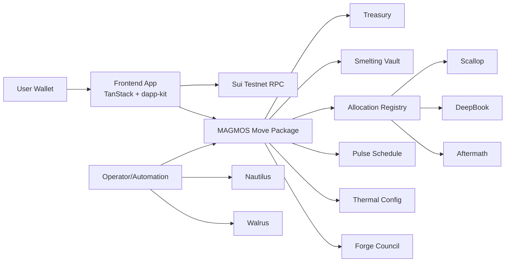
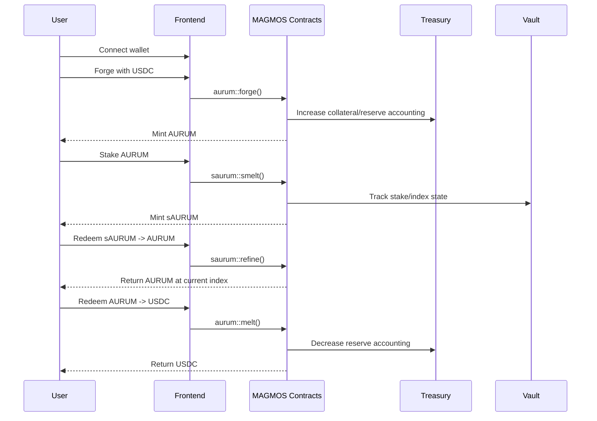

# MAGMOS (AURUM) - Sui Overflow 2026

MAGMOS is a composable yield-dollar protocol on Sui.

- `AURUM` - unit-stable dollar minted from USDC collateral.
- `sAURUM` - index-based yield token produced by staking AURUM.
- `MAGMA` - governance and fee-sharing token lane.
- `VYSS` - permissioned yield stream for registered AURUM holders.
- `Liquidity Layer` - LP yield hook for AURUM-sided liquidity.
- `Thermal Limits + Forge Council` - risk controls and scoped governance.

## Architecture

### High-level system diagram

### Token lifecycle diagram

## What is live now

- Move contracts are deployed on **Sui testnet**.
- Frontend reads are live (no mocked dashboard history/earnings path for connected wallets).
- Wallet write flows are active:
  - `/aurum` - forge, smelt, and wallet-bound withdraw/redeem flows.
  - `/saurum` - refine and redeem helper flow.
- Dashboard/Profile are wallet-gated and user-specific.

## Quick start

1. Install dependencies: `npm install`
2. Run app: `npm run dev`
3. Build: `npm run build`
4. Lint: `npm run lint`

## Contracts

- Contract root: `contracts/`
- Run tests:
  - `cd contracts`
  - `sui move test`
- Publish example:
  - `sui client publish --gas-budget 500000000`

## Deployed testnet IDs

- MAGMOS package: `0xe12b3253116bc30fc1f039edcf6bb6ff6f2e93b6a03852e4a021c86b8304194e`
- Treasury: `0xa86b7f83bc7ab07b8ae3641b06c7db74e067dc0872022ba0b43dac1704b3f3b6`
- Vault: `0x12b4a476a0a1e82816f2907117a041cfda0f447165f15926d340c83228483776`
- ThermalConfig: `0x4366c8c64b04864e1c096c305fb21e54621d5021d7075d06a9f2f80d72831cb4`
- PulseSchedule: `0xd6585bc9fb1104d309f2cad88468cf2fbeaaa8caddcbb1ef022c85336cca37ad`
- AllocationRegistry: `0xfb2d7f2aff0529db9356743939af946b0735c4357de26940f09ac71e7abe14cb`
- ForgeCouncil: `0x3d0eae435488c45809658d14e720931075d957bdae77e8b7584098571ec1d461`
- MAGMA pool: `0xc8c434230e4311ad0a29dcf951410f9fae73a79f2822fea8373e34295d372871`
- VYSS registry: `0x0d07ced9e7a518c620349cce090042c70d9128e2da1ebc517c5474ebfb347a0b`
- Liquidity registry: `0xb6c90f1fea93870944fe7ba2d2bb89b77b1c333739edf6546c15454def4bcb92`

## Submission docs

- `SUBMISSION_FIELDS.md`
- `SUBMISSION_PACK.md`
- `JUDGE_QUICKSTART.md`
- `INFRA_SOAK_RUNBOOK.md`
- `memory/09_DEPLOYMENT.md`
